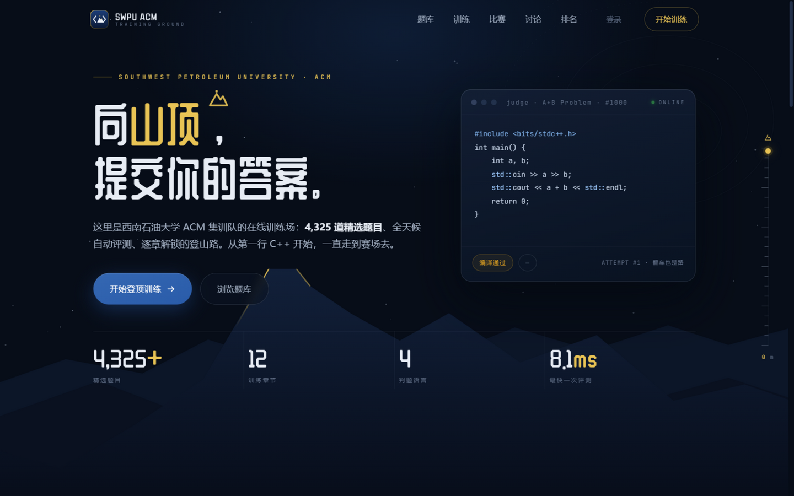
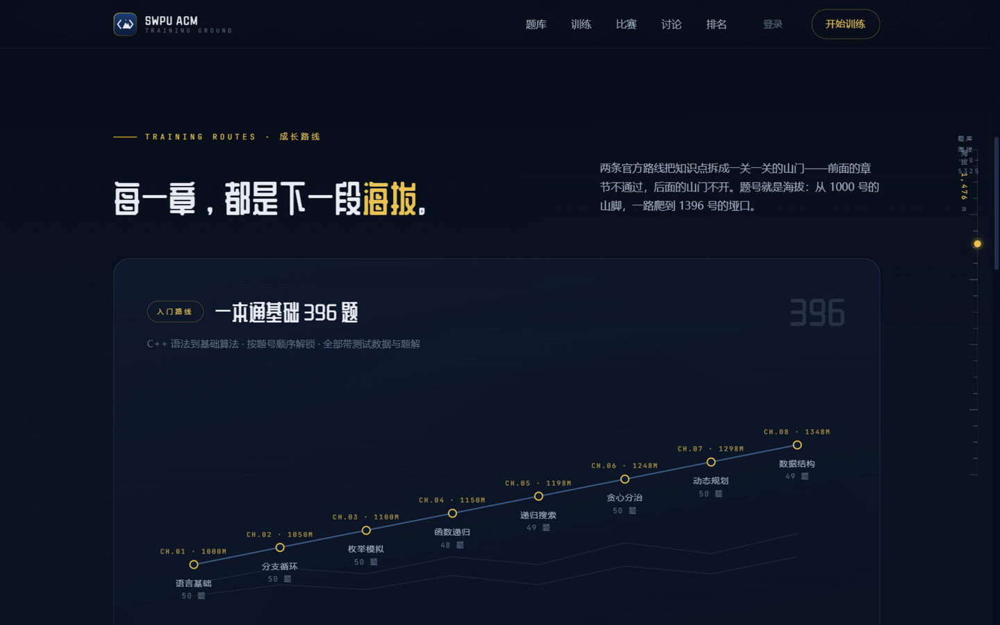
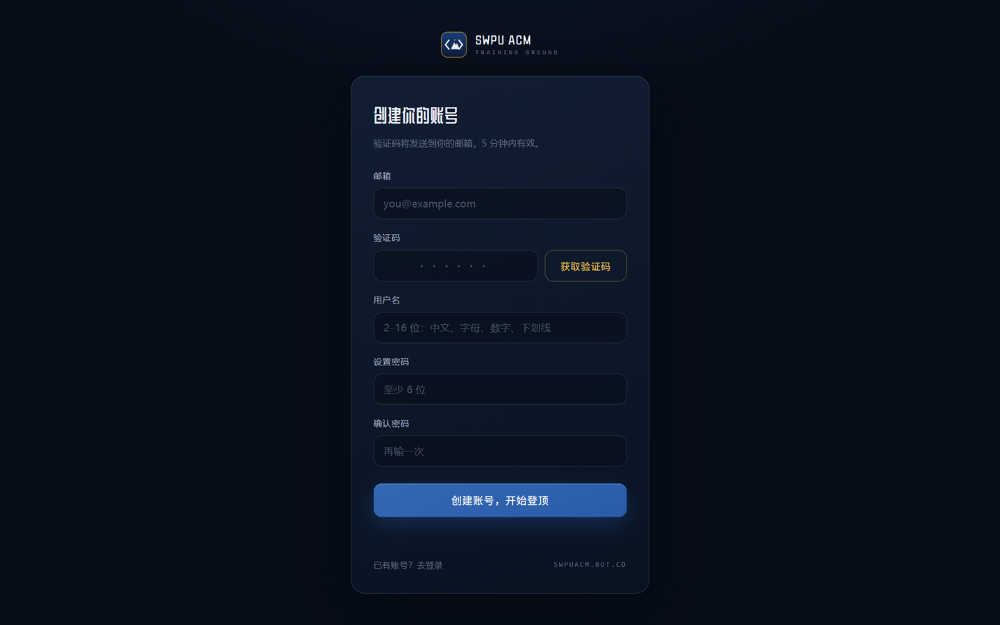
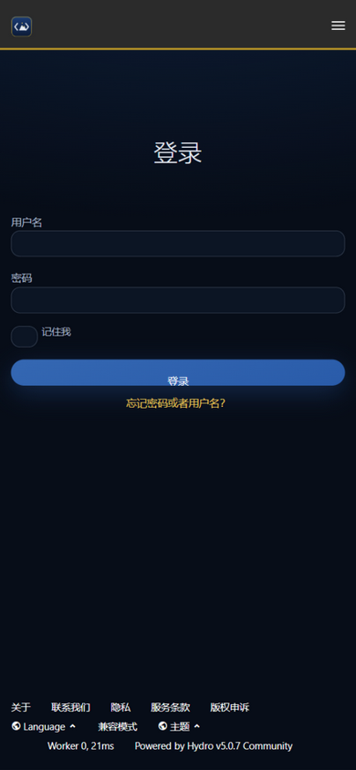

# SWPU OJ — 西南石油大学 ACM 在线训练站

[](https://github.com/11suixing11/swpu-oj/actions/workflows/ci.yml)

> 基于 [Hydro OJ](https://hydro.ac) v5.0.7 的院校级定制层：获奖级门面首页、数字验证码注册插件、品牌主题系统与一套完整的部署方案。

**线上实例**：[swpuacm.xyz](https://swpuacm.xyz)



## 这是什么

OJ 内核使用开源的 Hydro，本仓库收录的是我们围绕它做的**全部自研定制**——让一个开箱即用的 Hydro 实例变成有自己品牌、自己注册流程、自己性能策略的训练站。

| 模块 | 说明 |
|---|---|
| [`landing/`](landing/) | 门面首页：单文件 HTML/CSS/JS，零框架。「向山顶，提交你的答案」——新生入门指引、滚动海拔标尺、训练路线海拔剖面图、主动点击的评测流程演示、品牌图标与 OG 图 |
| [`plugin-swpu-regcode/`](plugin-swpu-regcode/) | 数字验证码注册 + 免密登录插件：`crypto.randomInt` 随机码、盐化摘要存储、一次性原子消费、绑定收件邮箱/UID/用途、登录策略与真实 IP 限速、5 分钟 TTL、QQ 号自动头像 |
| [`plugin-swpu-ops/`](plugin-swpu-ops/) | 管理员训练周报、判题健康摘要与可关闭的 RP 重算：报表只读，RP 会更新排名；无 HTTP 路由 |
| [`theme/`](theme/) | Hydro 原生 Light / Dark 双主题 + `00-brand.css` 品牌薄层；默认 light，保留用户偏好；01-05 为旧版回退 |
| [`deploy/`](deploy/) | Caddy 配置范例 + 一键安装脚本 + 脱敏部署清单：`home.html` 安装、assets 展平、UI 重建免疫、真实 IP、安全响应头 |
| [`scripts/`](scripts/) | 字体子集化（展示字体 440 字 107KB）、Pillow 图标渲染、备份包装器、只读部署检查 |

<p float="left">
  
  
  
</p>

## 为什么这么做

- **门面单文件零依赖**：中文展示字体按实际用字子集化后自托管，不依赖任何第三方 CDN；首页内容默认可见，不再等待开场动画或请求外部一言
- **数字验证码注册**：Hydro 原生只有「邮件点链接」确认，对国内用户不友好；本插件实现输码即注册，验证码走与找回密码相同的 SMTP 通道
- **UI 重建免疫**：Hydro 重装/升级会重建静态资源目录，门面放独立 `custom/` 目录由 Caddy 优先服务；主题用脚本可重复追加，升级后按清单重放
- **为国内访问调优**：BBR 拥塞控制、HTTP/3（QUIC）全链路、静态资源 7 天强缓存、DNS 层 HTTPS 记录（`alpn="h3,h2"`）让新访客首次连接即尝试 QUIC

## 快速开始

前置：一台已按[官方文档](https://docs.hydro.ac)装好 Hydro v5 的服务器（内置 Caddy）。

1. **门面**：在服务器运行 `bash deploy/install-landing.sh /root/.hydro/custom`。脚本会把 `index.html` 装成 `home.html`，并把 `landing/assets/*` 展平到根目录。
2. **注册插件**：把 `plugin-swpu-regcode/` 上传到 `/root/.hydro/addons/swpu-regcode`，建立 `node_modules/hydrooj` 软链，参考 `addon.json.example` 注册后 `pm2 restart hydrooj`。不要在插件目录执行 `npm install`。
3. **主题**：核对 `THEME_VERSION` 后运行 `bash deploy/install-theme.sh`，追加双主题品牌薄层 `00-brand.css`；必需文件缺失会直接失败，修改前备份。设置默认 light 见 [主题说明](theme/README.md)，不会清空用户偏好。
4. **邮件**：在系统设置配置 `smtp.host/user/pass/from/secure`，找回密码与验证码邮件即刻可用。
5. **反向代理**：设置 `server.xproxy: true`，并让 Caddy 覆盖客户端 XFF，详见 [deploy/deployment.md](deploy/deployment.md)。

## 文件结构

```
├── landing/               门面首页（单文件）+ 字体/图标资源
├── plugin-swpu-regcode/   数字验证码注册/免密登录插件（Hydro addon）
├── plugin-swpu-ops/       管理员训练周报与判题健康摘要（Hydro addon）
├── theme/                 原生 Light / Dark 品牌薄层 + 旧版回退 overlay
├── deploy/                Caddyfile / 安装脚本 / 部署清单
├── scripts/               字体子集化 / 品牌图标生成 / 备份 / 部署检查
├── .github/workflows/     CI：secret scan / 插件单测 / 仓库检查
└── docs/img/              截图
```

## 安全与验证

本地查看前端：在仓库根目录运行 `node scripts/preview.cjs`，打开 `http://127.0.0.1:4173/`。注册页为 `/reg`，验证码登录为 `/reg?tab=login`；预览不连接后端，不发送邮件或创建账户。改动与部署说明见 [新生前端体验优化](docs/frontend-update.md)。

- 验证码使用 `crypto.randomInt` 生成，带 purpose 绑定，失败次数通过 MongoDB 原子自增，显式检查 TTL。
- 只有直接对端是回环地址时才信任 `X-Forwarded-For` 首段；Caddy 配置会覆盖客户端传入的 XFF。
- CI 包含 gitleaks secret scan、插件单元测试、弃用域名扫描、Shell 语法和 Python 编译检查。
- `plugin-swpu-ops` 的管理员报表（`PRIV_EDIT_SYSTEM` + sudo）只读数据库并写本地文件；默认启用的 RP 重算会更新排名，可用 `SWPU_LIVE_RP=0` 关闭。没有公共 HTTP 路由。
- 仓库不包含 SMTP、数据库或服务器凭据；部署脚本修改主题前会自动备份。

## 致谢与许可

- OJ 内核：[Hydro OJ](https://hydro.ac)（本仓库不含其代码）
- 字体：[ZCOOL QingKe HuangYou](https://fonts.google.com/specimen/ZCOOL+QingKe+HuangYou)、[JetBrains Mono](https://www.jetbrains.com/lp/mono/)（均为 OFL 许可，见 `landing/FONTS-LICENSE.md`）
- 本仓库代码以 [MIT](LICENSE) 许可发布，供院校社团学习交流

> 西南石油大学 ACM 集训队 · 山高处见 — See you at the summit
