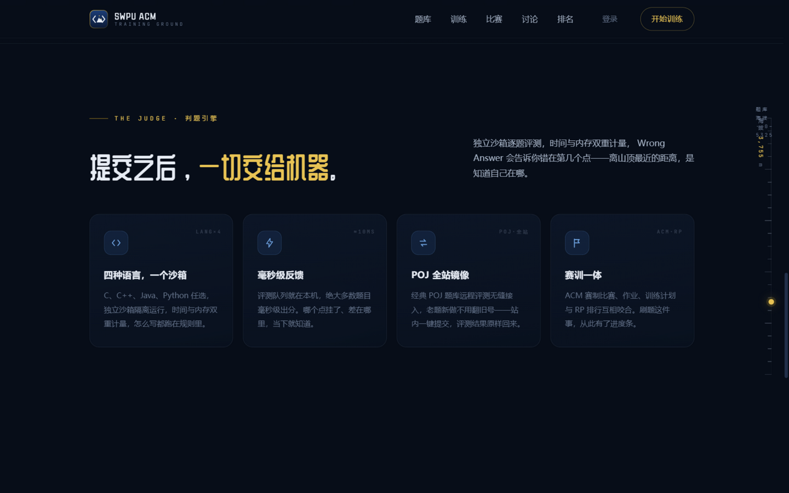
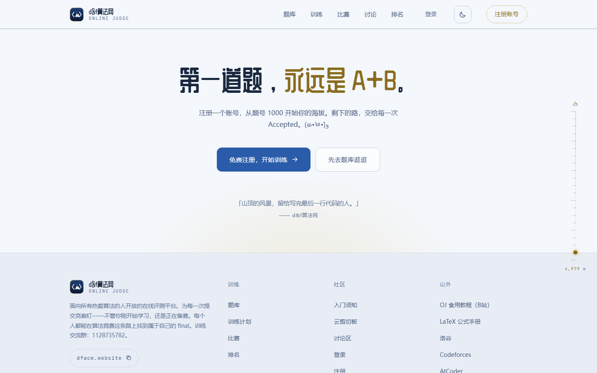

# d&f算法网 — 独立在线评测与训练平台

[](https://github.com/11suixing11/dfacm-oj/actions/workflows/ci.yml)

> 基于 [Hydro OJ](https://hydro.ac) v5.0.7 的独立平台定制层：品牌门面首页、一站式认证页、训练工作台 / 积分商店 / QQ 群播报、排名自动化与一键部署。

**品牌寓意**：每个人都能在算法竞赛这条路上找到属于自己的 final。

**平台域名**：[dfacm.website](https://dfacm.website)（主域名）；[swpuacm.xyz](https://swpuacm.xyz) 作为兼容入口保留。


## 这是什么

OJ 内核使用开源的 Hydro，本仓库收录的是我们围绕它做的**全部自研定制**——让一个开箱即用的 Hydro 实例变成有自己品牌、自己的认证与训练功能、自己的性能策略的训练站，并把训练动态自动带回 QQ 群。定制层不 fork 上游：功能以 addon 插件落地，门面与静态资源走独立目录由 Caddy 优先服务，对上游文件的修改全部打包成幂等、可重放的补丁脚本（带标记与锚点校验，UI 升级后重跑即可）。

| 模块 | 说明 |
|---|---|
| [`landing/`](landing/) | 门面首页：单文件 HTML/CSS/JS，零框架。「找到属于自己的 final」——入门指引、滚动海拔标尺、训练路线海拔剖面图、主动点击的评测流程演示、登录态感知（SSR 同源探测 + bfcache 回滚）、白天/夜间双主题、品牌图标与 OG 图 |
| [`plugin-swpu-regcode/`](plugin-swpu-regcode/) | 一站式认证页 `/reg`：注册账号 / 验证码免密登录 / 密码登录三个标签页 + GitHub OAuth 入口，全站唯一登录界面（裸 `/login`、`/register` 被 Caddy 原地重写为品牌页，站内登录弹窗替换为内嵌 overlay，`return` 参数登录后跳回原页）。验证码 `crypto.randomInt` 生成、盐化摘要存储、`findOneAndDelete` 原子消费、purpose 与收件地址绑定、真实 IP 限速、5 分钟 TTL |
| [`plugin-swpu-ops/`](plugin-swpu-ops/) | 管理员报表与排名自动化：训练周报 / 判题健康摘要两个只读脚本；RP 准实时重算（判题结束 30 秒防抖，不再等到凌晨）+ 每小时全域清扫 + 评测服务号状态自洁（防幽灵排名）+ 成员自动加域与每小时对账（任何注册路径漏网 ≤1 小时自愈上榜）。无公共 HTTP 路由 |
| [`plugin-swpu-train/`](plugin-swpu-train/) | 个人训练工作台 `/workbench` + 错题本 `/mistakes`：当前路线与下一题、本周进度、最近未通过；判题结束自动收集未 AC 题，记录错误原因、复盘笔记与补题状态 |
| [`plugin-swpu-shop/`](plugin-swpu-shop/) | 积分商店：每道题首次 AC 按难度（Hydro RP 同源算法）入账 1~10 积分，`/shop` 花积分兑徽章（复用 badge-for-hydrooj 持有链路），`/shop/history` 积分流水，`/manage/shop` 徽章定价上下架；`{uid, ref}` 唯一键幂等防双花，兑换失败自动退款 |
| [`plugin-swpu-broadcast/`](plugin-swpu-broadcast/) | QQ 群播报（AstrBot 插件，Python，部署在机器人服务器）：只读直连 OJ MongoDB 轮询，AC 卡片、每日榜单、比赛零配置直播（赛中实时发卡 + 终榜战报）、账号绑定 / 签到 / 账号合并；不抓网页、不动站点权限，与 Hydro 分离部署 |
| [`theme/`](theme/) | Hydro 原生 Light / Dark 双主题 + `00-brand.css` 品牌薄层；默认 light，保留用户偏好；01-05 为旧版回退 |
| [`deploy/`](deploy/) | Caddy 配置范例 + 一键部署编排器 `deploy.sh`（staged 上传 → 双端 sha256 对账 → 安装 → 唯一一次重启 → 就绪等待 → 冒烟电池）+ 门面/主题安装器 + 两个上游补丁（排名 own-row 去重与自己行高亮、单题 RP 保底）+ 脱敏部署清单 `deployment.md` |
| [`scripts/`](scripts/) | 字体子集化（按实际用字自托管）、本地静态预览、备份包装器、只读部署检查、落地页与部署脚本测试 |

<p float="left">
  
  
  
</p>
<p float="left">
  
  
</p>

## 为什么这么做

- **门面单文件零依赖**：中文展示字体按实际用字子集化后自托管，不依赖任何第三方 CDN；首页内容默认可见，不等待开场动画；登录态靠同源 SSR 探测感知，静态页也能对成员显示「欢迎回来」，bfcache 恢复与探测失败都安全回滚到游客视图
- **认证入口收敛为一个品牌页**：Hydro 原生注册是「邮件点链接」，登录 UI 又散落在原生页、顶栏与弹窗三处；我们把注册 / 验证码登录 / 密码登录 / GitHub OAuth 收进一个 `/reg`，其余入口全部收敛——URL 原地重写、弹窗替换为内嵌 overlay、登录后按 `return` 跳回原页
- **排名卫生自动化**：Hydro 的 RP 只在每天凌晨重算，而评测服务号在 `document.status` 留下的一条解题状态就足以复活幽灵排名、挤掉真人（都是真实踩过的事故）。准实时重算 + 每小时清扫 + 服务号自洁 + 成员自动加域，把这些运维铁律变成系统自愈（见 [CHANGELOG.md](CHANGELOG.md) v1.12 / v1.14 / v1.17）
- **UI 重建免疫**：Hydro 重装/升级会重建静态资源目录，门面放独立 `custom/` 目录由 Caddy 优先服务；主题用脚本幂等追加，上游模板补丁带标记可重放，升级后按清单补齐即可
- **为国内访问调优**：静态资源 7 天强缓存；HTTP/3 由 Cloudflare 免费版在边缘终结、Caddy 自动启用 h3（DNS 侧的 HTTPS/SVCB 记录由 CF 为橙云主机自动发布，不手工维护，详见 [deploy/deployment.md](deploy/deployment.md) 第 14 节）

## 快速开始

前置：一台已按[官方文档](https://docs.hydro.ac)装好 Hydro v5 的服务器（内置 Caddy）。

**推荐——一键部署**（从本地检出执行，Git Bash / Linux 均可；连接参数用 `SSH_TARGET` / `SSH_KEY` 等环境变量覆盖）：

```bash
bash deploy/deploy.sh                # 上传暂存 → 双端校验 → 安装 → 唯一一次重启 → 就绪等待 → 冒烟
bash deploy/deploy.sh --sync-only    # 纯静态改动：只同步与安装，免重启
bash deploy/deploy.sh --stage-only   # 只上传并对账，不动线上任何文件
```

哈希不一致拒绝重启；staging 与激活分离，失败不污染线上。插件发货清单解析自 `deployment.md` 的 cp 块，**文档与实际发货永远不会漂移**。

**首次安装的分步命令**（[deploy/deployment.md](deploy/deployment.md) 各节有完整说明）：

1. **门面**：`bash deploy/install-landing.sh /root/.hydro/custom`——把 `index.html` 装成 `home.html`，字体与图标展平到根目录。
2. **插件**：把 `plugin-swpu-*/` 上传到 `/root/.hydro/addons/`，建立 `node_modules/hydrooj` 软链，参考 `addon.json.example` 注册后 `pm2 restart hydrooj`。不要在插件目录执行 `npm install`（会破坏软链）。
3. **主题**：`bash deploy/install-theme.sh`（主题版本自动探测，缺文件会先于任何修改失败；默认 light 的设置见 [主题说明](theme/README.md)，不清空用户偏好）。
4. **上游补丁（服务器一次性，升级后重跑）**：`bash deploy/patch-ranking-template.sh`（排名 own-row 去重 + 自己行高亮）与 `bash deploy/patch-rating-floor.sh`（单题 RP 保底，防止只过一道简单题的成员从榜单消失）。
5. **邮件**：系统设置配好 `smtp.host/user/pass/from/secure`，找回密码与验证码邮件即刻可用。
6. **反向代理**：设置 `server.xproxy: true`，让 Caddy 覆盖客户端 XFF（Cloudflare 接入见 deployment.md 第 6/14 节）。
7. **QQ 播报（可选）**：见 [plugin-swpu-broadcast/README.md](plugin-swpu-broadcast/README.md)——OJ 侧建只读 Mongo 账号 + UFW 放行机器人服务器，机器人侧装 AstrBot 插件；不在 `deploy.sh` 的发货清单里。

## 文件结构

```
├── landing/                 门面首页（单文件）+ 子集字体 + 品牌图标
├── plugin-swpu-regcode/     一站式认证页（Hydro addon，TypeScript）
├── plugin-swpu-ops/         管理报表与排名自动化（Hydro addon）
├── plugin-swpu-train/       训练工作台与错题本（Hydro addon）
├── plugin-swpu-shop/        积分商店（Hydro addon）
├── plugin-swpu-broadcast/   QQ 群播报（AstrBot 插件，Python）
├── theme/                   双主题品牌薄层 + 旧版回退 overlay
├── deploy/                  Caddyfile / 部署编排器 / 安装器 / 上游补丁 / 部署清单
├── scripts/                 字体子集化 / 本地预览 / 备份 / 部署检查 / 脚本测试
├── docs/                    前端更新说明 / 上游 issue 草稿 / 截图
├── .github/workflows/       CI：secret scan / 五套测试 / 仓库一致性检查
├── CHANGELOG.md             版本历史（v1.0.0 起）
└── LICENSE                  MIT
```

## 安全与验证

本地查看前端：在仓库根目录运行 `node scripts/preview.cjs`，打开 `http://127.0.0.1:4173/`。注册页为 `/reg`（`?tab=login` 验证码登录、`?tab=pwd` 密码登录）；预览不连接后端，不发送邮件或创建账户。改动与部署说明见 [d&f算法网前端体验优化](docs/frontend-update.md)。

- 验证码用 `crypto.randomInt` 生成、绑定 purpose（注册/登录互斥）、失败次数 MongoDB 原子自增、显式检查 TTL；登录码只发往账号已绑定的邮箱。
- 所有改状态的 POST（注册完成、验证码登录、错题本、商店兑换与管理页定价）都携带会话级 CSRF token（`timingSafeEqual` 比较）；发码接口刻意豁免——首次访客尚无可保护的会话。
- 只有直接对端是回环地址时才信任 `X-Forwarded-For` 首段；Caddy 配置覆盖客户端传入的 XFF，Cloudflare 场景由 `@fromcf` 钉扎真实 IP，CI 锁定两份 Cloudflare 网段列表逐字节一致。
- CI：gitleaks 全历史 secret 扫描、五套测试全量执行（regcode / train / ops / shop / 部署与落地页脚本，约 200 项）、`shellcheck -S warning`、Caddyfile 解析检查、CSRF 覆盖 wiring 断言、注入面与主题作用域回归锁、弃用域名扫描；文档里无法在仓库实现中验证的调优声明一旦再引入即失败。
- `plugin-swpu-ops` 的报表脚本（`PRIV_EDIT_SYSTEM` + sudo）只读数据库、写 0700 权限的本地报表文件；RP 重算 / 清扫 / 自动加域 / 服务号自洁可分别用 `SWPU_LIVE_RP` / `SWPU_RP_SWEEP` / `SWPU_AUTO_JOIN` / `SWPU_SERVICE_UIDS` 环境变量关闭。没有公共 HTTP 路由。
- 仓库不含 SMTP、数据库或服务器凭据；QQ 播报的连接串走 `mongo_uri.txt`（已 gitignore，仅提交 example）；部署与主题脚本修改前自动备份到发布目录之外。

## 致谢与许可

- OJ 内核：[Hydro OJ](https://hydro.ac)（本仓库不含其代码）
- 徽章能力：[badge-for-hydrooj](https://github.com/Godtokoo666/badge-for-hydrooj)（商店只复用其模型，不 fork、不修改）
- QQ 播报框架：[AstrBot](https://github.com/AstrBotDevs/AstrBot)
- 字体：[ZCOOL QingKe HuangYou](https://fonts.google.com/specimen/ZCOOL+QingKeHuangYou)、[JetBrains Mono](https://www.jetbrains.com/lp/mono/)（均为 OFL 许可，子集化方法见 `landing/FONTS-LICENSE.md`）
- 本仓库代码以 [MIT](LICENSE) 许可发布，供算法学习社区交流

> d&f算法网社区 · 每个人都能在算法竞赛这条路上找到属于自己的 final。
